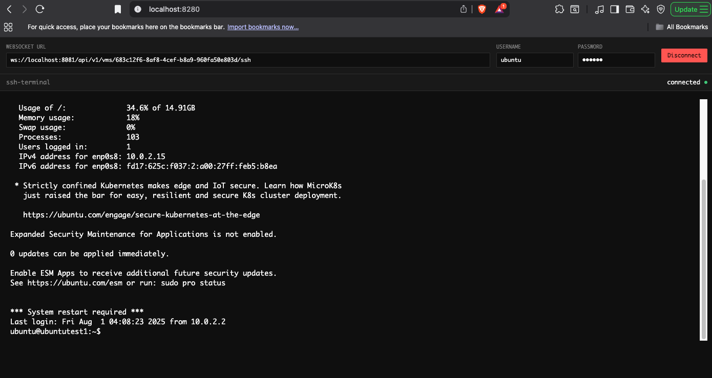

# WebSocket SSH Terminal Interface

A modern, browser-based SSH terminal that connects to servers via WebSocket protocol. This interface provides a seamless terminal experience with real-time SSH connectivity through your web browser.



## Usage

### 1. Open the Interface

Simply open `index.html` in your web browser. The interface will load with a connection form at the top and a terminal area below.

### 2. Configure Connection

Fill in the connection details:

- **WebSocket URL**: The WebSocket endpoint for your SSH server
  - Format: `ws://hostname:port/path/to/ssh/endpoint`
  - Example: `ws://localhost:8081/api/v1/vms/683c12f6-8af8-4cef-b8a9-960fa50e803d/ssh`
- **Username**: Your SSH username
- **Password**: Your SSH password

### 3. Connect

Click the **Connect** button or press Enter in the password field to establish the connection.

### 4. Use the Terminal

Once connected, you can:

- Type commands as you would in a regular SSH terminal
- Use all standard terminal features (copy/paste, scrolling, etc.)
- Navigate using arrow keys and other keyboard shortcuts
- Execute any SSH-compatible commands

### 5. Disconnect

Click the **Disconnect** button to close the SSH connection.

## Connection States

The interface provides visual feedback for different connection states:

- 🔴 **Disconnected**: No active connection
- 🟡 **Connecting**: Attempting to establish connection
- 🟢 **Connected**: Successfully connected and ready for use

## File Structure

```
websocket-ssh/
├── index.html          # Main application file
├── xterm.js           # xterm.js terminal emulator library
├── xterm.css          # Terminal styling
├── image.png          # Screenshot of the interface
└── README.md          # This documentation
```
